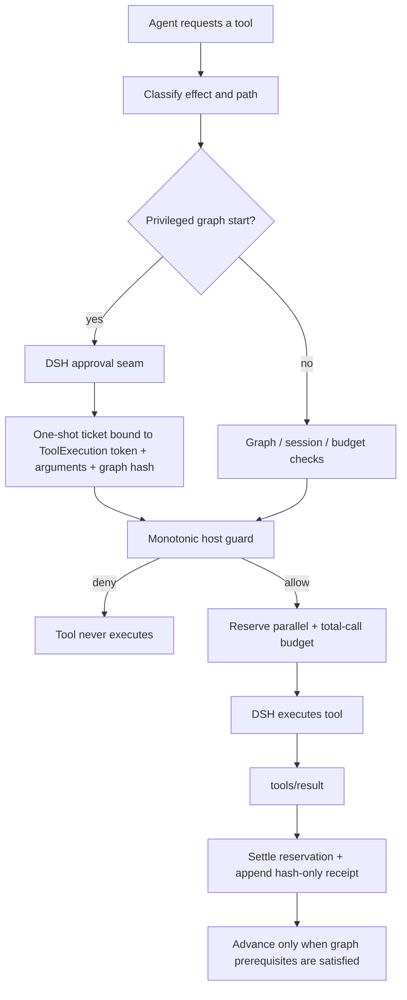
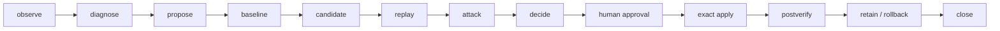

# GraphLean

**Minimal-context execution graphs with host-enforced constraints for DeepSeek Harness.**

[](#release-status)
[](https://github.com/deepseek-ai/deepseek-harness)
[](#compatibility)
[](LICENSE)

GraphLean keeps graph governance out of the model prompt. The checks that must be trusted run in the DeepSeek Harness tool path.

The model does not carry a standing policy block for graph order, write permissions, approvals, budgets, session state, or rollback. Those rules stay in the host runtime. When a call violates them, the host rejects it before the tool runs.

The v1.0.0 build reports this context surface:

| Surface | Measured |
|---|---:|
| GraphLean system-prompt policy injection | **0 bytes** |
| Model-visible GraphLean control tools | **5** |
| Model-visible control-tool metadata | **1,702 bytes** |
| Host-side executable graph templates | **10** |
| Host-side graph JSON | **49,380 bytes** |

These are serialized byte counts, not tokenizer counts. They cover GraphLean only, not DeepSeek Harness base tools, conversation history, or provider messages. Reproduce them with `node benchmarks/measure-context-surface.mjs`.

## Why this exists

A graph can describe an execution plan without enforcing it. A prompt can ask an agent to verify before writing, but it cannot by itself stop the write from reaching the tool layer.

The implementation has two bounded goals:

1. **Keep governance context small.** Graph definitions and enforcement state live in the host. The model-visible surface is bounded to a small set of control tools rather than a large standing policy prompt.
2. **Enforce the graph where actions run.** Graph position, tool effect, workspace boundary, approval state and call budgets are checked in the Harness tool pipeline. A denied call does not execute.

GraphLean is therefore a host-side execution constraint layer, not a planner or a prompt framework.

| Question | Prompt / planner | GraphLean |
|---|---|---|
| Where is most governance state kept? | Usually model context / framework state | **Host-side state** |
| Does the model need the full graph policy in its prompt? | Often | **No** |
| Can an out-of-policy tool call be refused before execution? | Not by prose alone | **Yes** |
| Can a privileged graph self-authorize? | Framework-dependent | **No; host approval is required** |
| Are parallel and total call budgets reserved before execution? | Framework-dependent | **Yes** |
| Is self-modification bound to the reviewed exact calls? | Framework-dependent | **Yes** |

The comparison is about the trust boundary, not a claim that other graph frameworks lack similar checks. GraphLean places these checks in the DSH host integration instead of relying on model compliance.

## Install

The release contains a standard DeepSeek Harness bundle and a transactional one-click installer.

### Native DSH bundle

From the release tarball:

```bash
dsh plugin --profile web add ./graphlean-1.0.0.tgz
dsh --profile web --dump-config
dsh --profile web
```

Remove it with:

```bash
dsh plugin --profile web remove graphlean
```

DeepSeek Harness documents this bundle flow under `dsh.bundle` / `dsh plugin add`.

### Transactional one-click install

Use this when you want machine-wide installation under a target `DSH_HOME`, preimage backups, post-install verification, loader probing and automatic rollback on failure.

Windows:

```bat
INSTALL_WINDOWS.cmd
```

PowerShell:

```powershell
./INSTALL_ONE_CLICK.ps1
```

Linux / macOS:

```bash
./INSTALL_UNIX.sh
```

If a real `dsh` executable is available, the installer runs:

```bash
dsh --profile web --dump-config
```

A failed loader probe rolls the installation back. Stop DSH processes using the same `DSH_HOME` before installing or uninstalling.

Do not install the same checkout through both the native bundle path and the machine-wide one-click path at the same time.

## Execution path



The approval listener is not the final security boundary. It mints a one-shot in-memory ticket; the later host guard must consume that same ticket for the same execution. If approval is skipped, replayed, crossed between sessions, or the arguments change, privileged activation fails closed.

## What is actually enforced

The host currently enforces:

- deterministic DAG progression, including fork/join dependencies;
- validated optional branch bundles with one root and one sink for every legal activation profile;
- agent + session scoped active state;
- graph-template and persisted-state integrity checks;
- explicit tool effect classes instead of name-prefix guessing;
- workspace confinement for governed filesystem, search and editor calls;
- denial of governed access to `DSH_HOME` and GraphLean control-plane state;
- host approval before a graph with write or external authority can activate;
- admission-time `max_parallel_calls` and `max_tool_calls` reservations;
- a total graph wall-clock deadline;
- binding of a tool result to the exact admitted tool call;
- exact ordered mutation approval for graph-encoded self-evolution;
- hash-only runtime receipts for governed calls.

Composite or unbounded execution surfaces are hard-denied by the default governance profile, including shell/terminal execution, `run_code`, dynamic Cordis execution, workflow, Ralph and DSH Skill execution. Protected built-ins cannot be reclassified through GraphLean configuration.

## Tool effects

| Effect | Typical examples | GraphLean behavior |
|---|---|---|
| `read_only` | read, grep, glob, LSP | Must remain inside the governed workspace/control-plane boundary |
| `user_interaction` | ask user, plan approval | May interact with the user but cannot satisfy write/external nodes |
| `workspace_write` | write, edit | Requires an active node with write authority |
| `external_action` | web, subagent, host-state actions | Requires an active external-action node |
| `hard_deny` | shell, run-code, dynamic Cordis, Skill | Refused under hard governance |
| unknown | custom tool | Refused unless an administrator explicitly classifies a bounded tool |

`external_action` is an effect class, not a semantic allowlist for every individual node. Self-evolution is intentionally stricter: each mutation must match the approved ordered call sequence exactly.

## Graphs

The release ships ten executable templates validated against one schema and one runtime validator:

| Template | Use |
|---|---|
| `inline-micro` | Small execute → verify/close path |
| `inline-advised` | Small task with bounded independent review |
| `adaptive-execution` | Bounded adaptive branch |
| `evidence-audit` | Evidence collection and verification |
| `evidence-research` | Multi-source research and synthesis |
| `hypothesis-diagnosis` | Competing-hypothesis diagnosis |
| `multi-artifact` | Parallel artifact work with an explicit join |
| `work-dag` | General staged work |
| `quality-improvement` | Candidate → reproduce → dispute → blind review |
| `self-evolution` | Reviewed mutation → exact apply → retain/rollback |

The six files under `graph/quality/patterns/` are descriptors for validation and cataloging; they are not a second scheduler.

## Self-evolution uses the same graph path

There is no separate background evolution worker or state machine.



At `candidate`, the runtime seals an ordered list of exact workspace-write calls. Persistent state stores hashes; raw candidate arguments remain in a local review packet until approval or abort. The packet is hash-bound to the active run.

Inspect the candidate:

```bash
graphleanctl candidate-show \
  --state-root <DSH_HOME>/graphlean/state \
  --run <RUN_ID>
```

Approve exactly what was reviewed:

```bash
graphleanctl approve \
  --state-root <DSH_HOME>/graphlean/state \
  --run <RUN_ID> \
  --candidate-hash <SHA256>
```

Extra, missing, reordered, duplicated or argument-changed mutations are rejected at apply time. If post-verification fails, the graph can roll back instead of retaining the candidate silently.

## Crash ambiguity

If a tool may have produced a side effect but DSH dies before `tools/result` settles the reservation, GraphLean does not guess. It keeps the call pending, does not replay it automatically, and does not manufacture a success receipt.

After inspecting the actual state, an operator can abandon the ambiguous run out of band:

```bash
graphleanctl recover-abort \
  --state-root <DSH_HOME>/graphlean/state \
  --run <RUN_ID>
```

The run is archived as aborted. This is deliberately weaker than an exactly-once claim, and safer than replaying an uncertain side effect.

## Context surface

The minimal-context claim is intentionally narrow and measurable.

GraphLean itself does not inject a policy block into the system prompt. At plugin load, its model-visible governance surface is the metadata for five control tools. The graph templates, topology checks, effect classifications, budgets, approvals and runtime state remain host-side unless the agent explicitly asks for status.

Reproduce the measurement:

```bash
node benchmarks/measure-context-surface.mjs
```

The checked-in result is [`benchmarks/context-surface.json`](benchmarks/context-surface.json). The release test suite fails if this result drifts without being regenerated, if the control surface grows beyond its current bound, or if the graph payload accidentally moves into the model-visible surface.

The measurement is **not** a claim that a GraphLean session uses only 1,702 bytes of total model context. DSH base tools, conversation history, user messages and provider-specific framing are outside this measurement.

## Verification

Run the repository gates:

```bash
python -m pip install -r requirements-dev.txt
python -B -m unittest discover -s tests -v
python -B SELFTEST.py
node --check dsh/index.js
node benchmarks/measure-context-surface.mjs
npm pack --dry-run --json
```

Build deterministic release artifacts:

```bash
python -B RELEASE.py --output-dir dist
```

The release builder stages an allowlisted clean tree, regenerates integrity manifests, runs the behavioral/security/install tests, performs an isolated install → verify → uninstall preimage smoke, packs the official DSH bundle twice, builds the source ZIP twice, and requires byte-for-byte reproducibility.

For a real target DSH installation:

```bash
python SELFTEST.py --target <DSH_HOME> --probe-dsh --profile web
```

Without the real loader probe, `SELFTEST.py` is not evidence that a particular DSH binary loaded the bundle.

## Release status

v1.0.0 is the first public release of GraphLean.

For v1.0.0, the release gate records **37/37 passing behavior, security, context-surface, graph, privacy and installer tests**, plus 10/10 executable graph validation and 6/6 quality-pattern validation. Hashes for the final ZIP and TGZ are emitted alongside the artifacts; [`docs/RELEASE_VALIDATION.md`](docs/RELEASE_VALIDATION.md) records the evidence boundary.

If the machine running the release build does not contain a compatible real `dsh` executable, the build does not claim a real DSH boot test. The one-click installer and `SELFTEST.py --probe-dsh` perform that check on the deployment machine.

## Transactional uninstall

Normal uninstall removes only bytes still matching the managed installation and preserves unrelated patch edits:

```bash
python UNINSTALL.py --dsh-home <DSH_HOME>
```

To explicitly discard post-install GraphLean changes and restore the bound pre-install snapshot:

```bash
python UNINSTALL.py --dsh-home <DSH_HOME> --restore-backup
```

Installer metadata paths are not trusted as deletion targets; bound backups are fingerprint-verified before destructive restoration.

## Privacy boundary

GraphLean receipts persist graph/node identifiers, timestamps, counters, tool/effect names, status and cryptographic hashes. They do not persist raw prompts, raw tool arguments, raw tool results, source bodies, diffs, environment variables or API keys.

The Harness stack is not necessarily local-only. DeepSeek Harness, model providers, telemetry, conversations, external tools and other administrator-installed plugins may independently store or transmit data.

The release scanner rejects common credential files and high-confidence token/key patterns, bytecode/cache artifacts, symlinks, path traversal and leaked user-home paths.

## Security boundary

GraphLean is not an OS sandbox.

Its trusted computing base includes DeepSeek Harness core and its ToolExecution contract, Node.js, the operating system, configured filesystem/tool providers, administrator-installed plugins and the integrity of the local GraphLean installation/state directory.

GraphLean can constrain governed tool execution, but it cannot prove that model reasoning is correct, protect against a malicious kernel/provider, or promise confidentiality for data independently logged by DSH or a model provider.

## Compatibility

GraphLean targets the current public DeepSeek Harness bundle/tool contract and Node.js `^22.19.0 || >=24.0.0`.

DeepSeek Harness is evolving. Run the loader probe against the DSH version you deploy; do not assume forward compatibility.

GraphLean is a community project and is not an official DeepSeek product.

## Repository layout

```text
graphlean/
├── package.json                 # DSH bundle manifest
├── cordis.patch.yml             # profile-scoped bundle layer
├── dsh/index.js                 # host guard + graph runtime adapter
├── graph/
│   ├── templates/               # canonical execution graphs
│   ├── quality/                 # quality graph + pattern descriptors
│   └── evolution/               # graph-encoded self-evolution
├── schemas/                     # graph schema
├── benchmarks/                  # model-visible context-surface measurement
├── tests/                       # behavior, attack and installer tests
├── graphleanctl.py              # validation / approval / recovery CLI
├── INSTALL_*                    # transactional one-click installers
├── UNINSTALL_*                  # safe uninstall / exact restore
├── SELFTEST.py                  # source + installed-state verification
└── RELEASE.py                   # deterministic release builder
```

## License

MIT. See [LICENSE](LICENSE).

